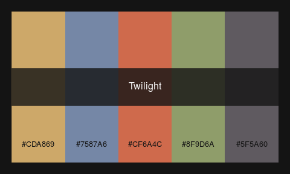
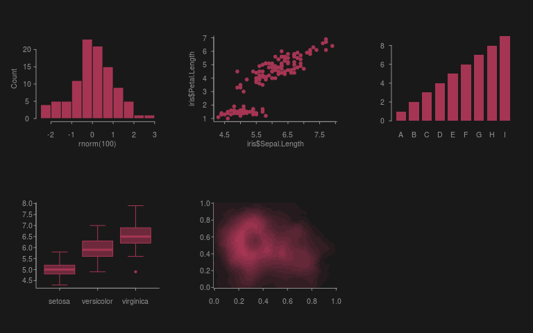
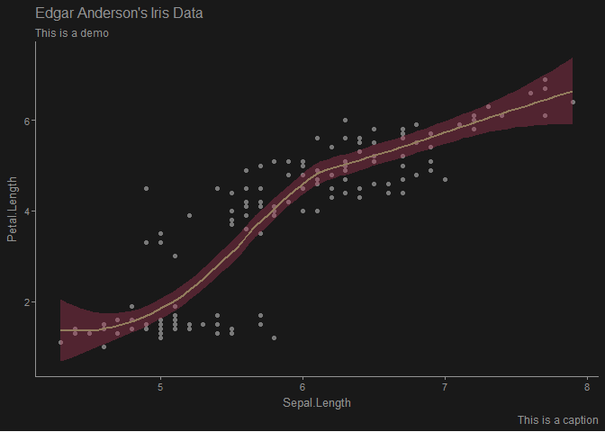
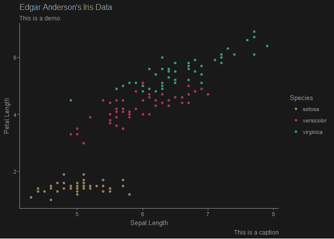

<!-- README.md is generated from README.Rmd. Please edit that file -->
editheme
========

### Palettes and graphics matching your RStudio editor

The package editheme provides a collection of color palettes designed to match the different themes available in RStudio. It also includes functions to customize 'base' and 'ggplot2' graphs styles in order to harmonize the look of your favorite IDE.


### Install

To install the package from Gihub you can use devtools:

``` r
devtools::install_github("fkeck/editheme")
```

``` r
library(default)
library(editheme)
```

### Palettes

Print the list of available palettes with `list_pal`:

``` r
list_pal()
#>  [1] "Ambiance"              "Chaos"                
#>  [3] "Chrome"                "Clouds"               
#>  [5] "Clouds Midnight"       "Cobalt"               
#>  [7] "Crimson Editor"        "Dawn"                 
#>  [9] "Dracula"               "Dreamweaver"          
#> [11] "Eclipse"               "Idle Fingers"         
#> [13] "Katzenmilch"           "Kr Theme"             
#> [15] "Material"              "Merbivore"            
#> [17] "Merbivore Soft"        "Mono Industrial"      
#> [19] "Monokai"               "Pastel On Dark"       
#> [21] "Solarized Dark"        "Solarized Light"      
#> [23] "TextMate"              "Tomorrow"             
#> [25] "Tomorrow Night"        "Tomorrow Night Blue"  
#> [27] "Tomorrow Night Bright" "Tomorrow Night 80s"   
#> [29] "Twilight"              "Vibrant Ink"          
#> [31] "Xcode"
```

Get one specific palette with `get_pal` and visualize it with `viz_pal`:

``` r
my_pal <- get_pal(theme = "Twilight")
viz_pal(my_pal, print.hex = TRUE)
```



`get_pal` is smart, if you are using RStudio, it can find automatically the palette matching your current theme using rstudioapi, just type:

``` r
get_pal()
```

[All available palettes](man/figures/viz_all_pal.png)

### Customizing base graphics

To change the look of base graphics editheme uses the styles package. The function `set_base_sty` modifies the graphical parameters and the behavior of different plotting functions according to the selected theme.

``` r
set_base_sty("Clouds Midnight")
par(mfrow = c(2, 3))
hist(rnorm(100))
plot(iris$Sepal.Length, iris$Petal.Length)
barplot(1:9, names.arg = LETTERS[1:9])
boxplot(iris$Sepal.Length ~ iris$Species)
image(volcano)
```



Tip: Just like `get_pal`, `set_base_sty` is smart. If you are using RStudio, it can find automatically your current theme. Just type: `set_base_sty()`

### Customizing ggplot2 graphics

The package provides a ggplot2 theme function `theme_editor` and scales functions (`scale_color_editor`, `scale_fill_editor`) to control the appearance of the plot.

``` r
library(ggplot2)
pal <- get_pal(theme = "Clouds Midnight")

ggplot(iris, aes(Sepal.Length, Petal.Length)) +
  geom_point(color = col_fg(pal, fade = 0.2)) +
  geom_smooth(color = pal[1], fill = pal[2]) +
  labs(title = "Edgar Anderson's Iris Data",
    subtitle = "This is a demo", caption = "This is a caption") +
  theme_editor("Clouds Midnight")
#> `geom_smooth()` using method = 'loess'
```



``` r

ggplot(iris, aes(Sepal.Length, Petal.Length, color = Species)) +
  geom_point() +
  labs(title = "Edgar Anderson's Iris Data",
    subtitle = "This is a demo", caption = "This is a caption") +
  theme_editor("Clouds Midnight") +
  scale_color_editor("Clouds Midnight")
```



Tip: ggplot2 theme functions can find automatically your current theme. Just type: `theme_editor()`, `scale_color_editor()`, etc...
